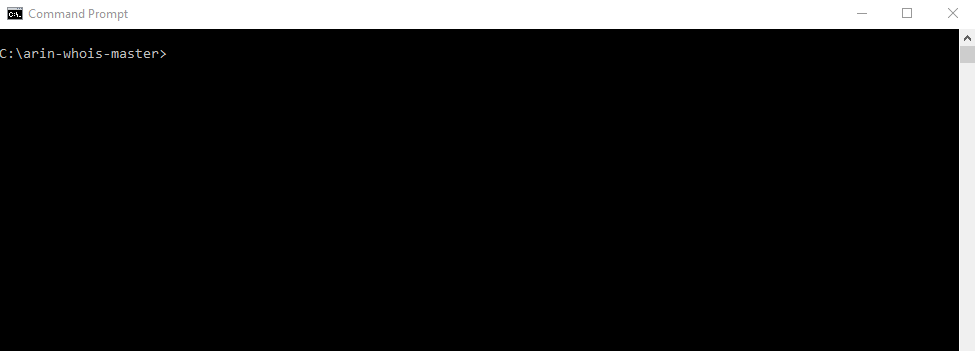
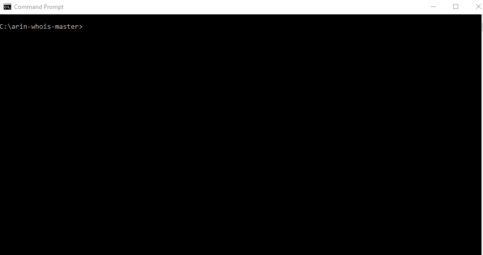

# ARIN Whois - whois.arin.net

Python Code for using ARIN’s Whois RESTful web service to pull network and organization records.

# Requirements (Setup)

- Python 3.9
- requests
- argparse
```
pip3 install -r requirements.txt
```

## Usage
```
python whois.py -i 8.8.8.8
python whois.py --ip 8.8.8.8
```
## Demos





# Troubleshooting
- If you are receiving errors, please look at the Issues queue and see if there is already an issue open.

- If you have a unique issue, please create a new Issue, and include the output of your terminal.
